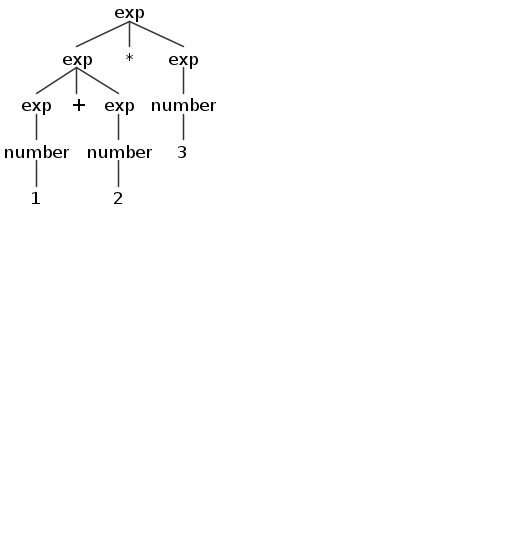

[TOC]

---

#### 任务描述
本关任务：根据 C1 语言的 EBNF 描述（见关卡$$1$$），修改并完善本实训版本库中 C1 语言的语法描述文件`c1recognizer/grammar/C1Parser.g4`，编译和运行生成的语法分析器。请：
1. 熟悉使用本实训 **简介** 节介绍的`antlr4`和`grun`工具正确构造你的语法分析器；
2. 编写若干个正确的和错误的 C1 程序作为测试用例，来测试你的 C1 语法分析器；
3. 回答本关所列的问题`Parser-Q1` ~ `Parser-Q2`。

请严格按照要求组织本实训项目的目录和文件，助教会借助脚本实现对本关实践任务的半自动检查。

##### 任务分解与提交要求
1. 阅读理解版本库中提供的 C1 语言的词法描述文件`c1recognizer/grammar/C1Lexer.g4`，建立与语法描述文件`c1recognizer/grammar/C1Parser.g4`之间的关系；
2. 修改并完善版本库中 C1 语言的语法描述文件`c1recognizer/grammar/C1Parser.g4`；
3. 用antlr4生成分析器源码到build目录下(参考第2关编译和运行以及可视化)，理解`c1recognizer/grammar/C1Parser.g4`与生成的分析器源码之间的关系；
4. 测试输入应置于`test/test_cases/parser`目录下：
   - 正确测试用例文件名前缀为`pt_`；
   - 错误测试用例文件名前缀为`ft_`。
5. 在[`c1recognizer/doc/labLexerParser.md`](./labLexerParser.md)中编写对问题`Parser-Q1` ~ `Parser-Q2`的回答，描述实验遇到的问题。

>注意：本实验采用的Ubuntu22.04没有VNC界面，如果需要查看grun -gui的界面建议在虚拟机中运行。

##### 问题清单
**1. Parser-Q1 理解[`LL(*)`分析方法](http://www.antlr.org/papers/LL-star-PLDI11.pdf)\[[`PLDI 2011`](http://pldi11.cs.utah.edu/)\] 的原理**
* 简述`LL(*)`分析方法的核心逻辑，它与传统的`LL`分析区别在哪里？

* 证明下面的文法为`LL-regular`文法，并按照文章的`LL(*) parser`构造算法绘制该文法的 ATN 和 Lookahead DFA。在算法执行过程中会出现哪些问题？解释问题产生的原因。假设 ATNLR 允许的最大递归深度m=1：

```
S → Ac | Ad
A → aA | b
```
**2. Parser-Q2 理解[`Adaptive LL(*)`分析方法](https://dl.acm.org/citation.cfm?id=2660202)\[[`OOPSLA 2014`](https://2014.splashcon.org/)\]的原理**

* 给定如下文法，描述输入`xba`的`ALL(*)`分析过程并给出最终构造的`lookahead DFA`。
  ```
  S → xB | yC
  B → Aa
  C → Aba
  A → b | ε
  ```

#### 相关知识
##### C1 语言语法描述文件 C1Parser.g4

语法分析的语法文件（未完成）在`c1recognizer/grammar/C1Parser.g4`。它的初始内容如下：

```
parser grammar C1Parser;
options { tokenVocab = C1Lexer; }

compilationUnit: ;
decl: ;
constdecl: ;
constdef: ;
vardecl: ;
vardef: ;
funcdef: ;
block: ;
stmt: ;
lval: ;
cond: ;
exp:
    (Plus | Minus) exp
    | exp (Multiply | Divide | Modulo) exp
    | exp (Plus | Minus) exp
    | LeftParen exp RightParen
    | number
;
number: IntConst | FloatConst;
```

这里的文法文件类型为`parser grammar`，名称为`C1Parser`。`options { tokenVocab = C1Lexer; }`表示从`C1Lexer`引入`token`字典，这里不需要更改。

非终结符名称需要以小写字母开头，每条规则由非终结符名开始，冒号后跟随多条可选规则，用`|`分隔。规则可以出现左递归，但出现左递归的标识符必须存在非左递归的匹配规则。各种后缀标识符（`?`、`*`、`+`、`??`、`*?`、`+?`）含义与`Lexer`阶段相同，不再赘述。

当出现左递归时，运算符优先级按从上到下依次降低。默认的结合性为左结合，由于 C1 语言中不涉及右结合的运算，因此你暂时无须理会结合性的问题。如果你想了解更多关于`ANTLR Parser`规则的信息，请参考[`Parser Rules`](https://github.com/ANTLR/antlr4/blob/master/doc/parser-rules.md)。

在我们提供的 C1 语法描述文件中没有任何代码段，这贯彻了 [ANTLR v4](http://www.antlr.org/) 所提倡的如下思想：使用文法描述文件描述语言本身，而不必描述具体实现细节。也就是说，文法描述文件应当只是对语言本身文法的一个规范描述，它不应包括其实现逻辑（虽然 ANTLR 具备在文法描述文件中附加程序代码的功能，但并不提倡使用该功能，这一功能是从 ANTLR v3 遗留下来的）。

直到根据输入生成`parse tree`后，才通过用 ANTLR 工作语言编写的  Visitor（基于设计模式中的 Visitor 模式的思想来编写）遍历`parse tree`并生成抽象语法树 AST。我们将在下一关卡中介绍如何使用本关卡得到的分析结果。

#### 编译和运行以及可视化

[ANTLR v4](http://www.antlr.org/) 具备独立测试文法文件及将分析树/图和分析结果可视化的功能。在本实训的在线实验平台中，已经为你配置好编译、运行的环境。

如果你需要在自己的机器上开展实验，你可以使用`Visual Studio Code`作为编辑器，并安装 ANTLR 插件。在一个`.g4`文件的编辑窗口中右键，你会看到几个选项，点击即可。为了测试文法文件并可视化分析结果，你首先需要配置好 ANTLR v4 的工作环境。在此前提下，按如下步骤完成测试（在`c1recognizer/grammar`目录中）：

```bash
# Environment variable configuration(or you can add them to ~/.bashrc)
export CLASSPATH=".:/path/to/your/antlr-4.13.1-complete.jar:$CLASSPATH"
alias antlr4='java org.antlr.v4.Tool'
alias grun='java org.antlr.v4.gui.TestRig'
# Compile grammar to Java source code
antlr4 *.g4 -o ../build
cd ../build
# Compile Java source code
javac *.java
# Testing lexer
grun C1Lexer tokens -tokens ../test/test_cases/simple.c1
# Testing parser for compilationUnit(The goal you need to achieve). You will get nothing currently
grun C1 compilationUnit -tree ../test/test_cases/simple.c1
# inspect the parse tree in GUI
grun C1 exp -gui ../test/test_cases/incomplete_cases/exp/exp.c1
```
这里`simple.c1`是预置的简易测试文件。

你可以通过`grun`命令查看grun的帮助文档，其输出如下所示。在上述最后一条命令中`C1`是语法名称`GrammarName`，`compilationUnit`是`startRuleName`，即开始进行预测的非终结符。使用`grun C1 compilationUnit -tree compilationUnit <test_cases>`解析所有语法上符合C1语言规范的程序是你最终需要达到的目标。

```bash
$ grun
java org.antlr.v4.gui.TestRig GrammarName startRuleName
  [-tokens] [-tree] [-gui] [-ps file.ps] [-encoding encodingname]
  [-trace] [-diagnostics] [-SLL]
  [input-filename(s)]
Use startRuleName='tokens' if GrammarName is a lexer grammar.
Omitting input-filename makes rig read from stdin.
```

在完成实验时，你可以指定不同的`startRuleName`(例如`exp`)来逐步增强你的语法分析器的能力。例如你可以通过`grun C1 exp -tree ../test/test_cases/incomplete_cases/exp/exp.c1`来解析不完整的C1程序。逐步解析并充分考虑每一步解析的正确性可以帮助你快速构建鲁棒的语法分析器。

`-tree`选项会在命令行中生成解析树，难以调试。你也可以使用`-gui`选项使用图形化界面来查看你的语法规则在解析特定程序时是否符合预期。

在`grun`的命令中，你也可以不指定输入文件，而采用标准输入流作为输入文本。这时候你需要键入一个`EOF`标志来结束输入（在 Linux 等环境中是`Ctrl-D`）。参考的输出如下：

```bash
$ grun C1Lexer tokens -tokens
1+2*3<换行后输入Ctrl-D>
[@0,0:0='1',<IntConst>,1:0]
[@1,1:1='+',<'+'>,1:1]
[@2,2:2='2',<IntConst>,1:2]
[@3,3:3='*',<'*'>,1:3]
[@4,4:4='3',<IntConst>,1:4]
[@5,6:5='<EOF>',<EOF>,2:0]
$ grun C1 exp -tree
1+2<换行后输入Ctrl-D>
(exp (exp (number 1)) + (exp (number 2)))
$ grun C1 exp -gui
1+2*3<换行后输入Ctrl-D>
```

> 注意最后一条命令解析`1+2*3`得到的解析树如下图所示。:) 斜眼笑



